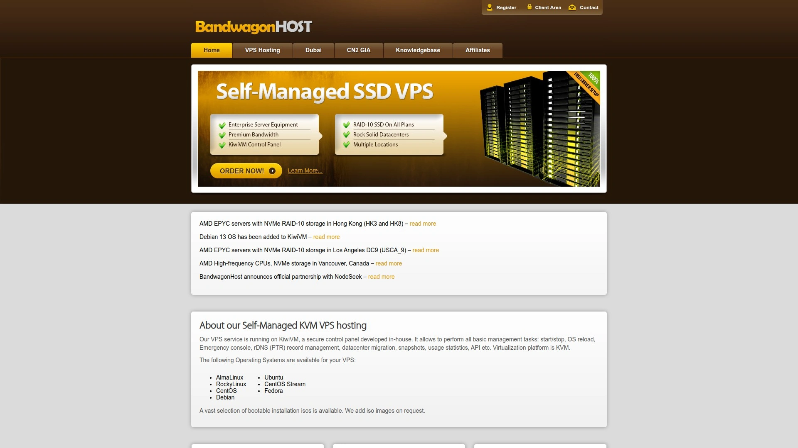
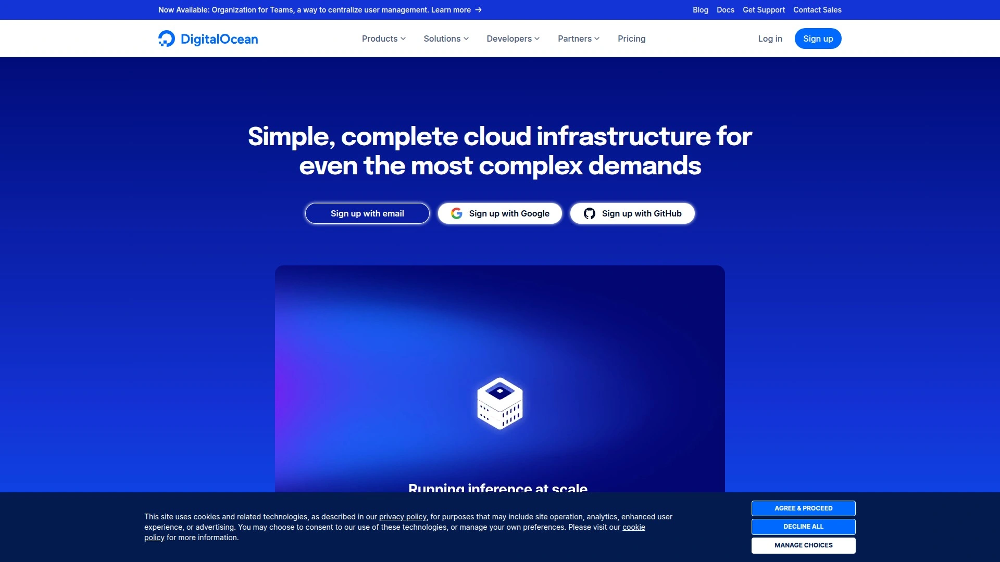
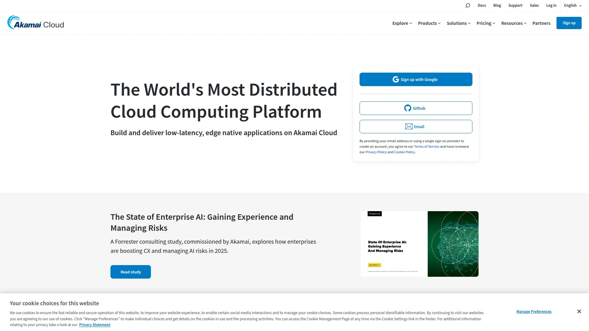
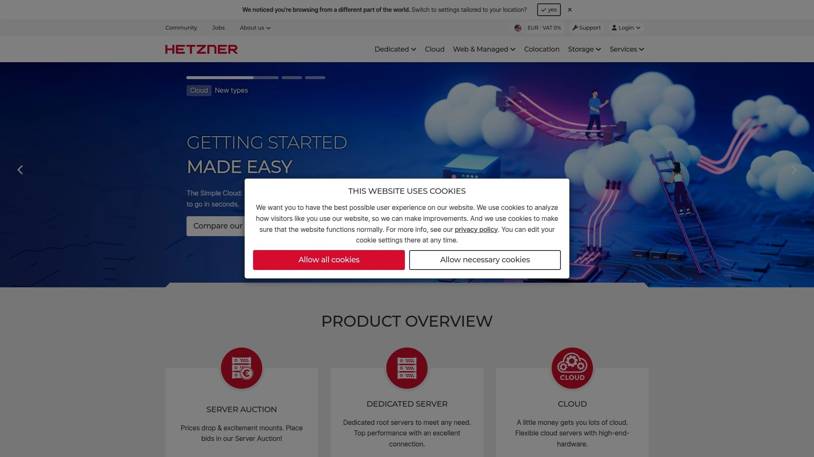
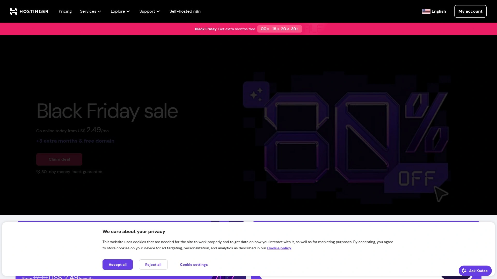
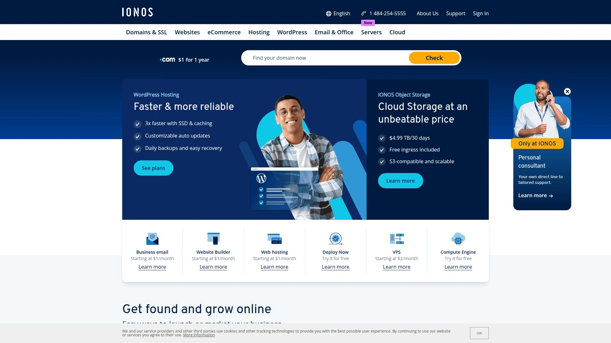

# 2025's Top 12 Best VPS Hosting Providers

Running a business app, spinning up development environments, or hosting high-traffic websites demands server resources you actually control—not shared hosting where neighbors slow you down. VPS hosting delivers dedicated CPU cores, guaranteed RAM, and root access so you configure everything exactly how you need it, from operating systems to security protocols. These twelve providers balance performance benchmarks, global data center coverage, pricing transparency, and technical flexibility for developers and businesses scaling beyond basic hosting.

---

## **[BandwagonHost](https://bandwagonhost.com)**

Enterprise-grade KVM infrastructure with KiwiVM control panel designed for self-managed hosting.

BandwagonHost runs KVM virtualization across enterprise-grade hardware that cuts downtime from equipment failures. The proprietary KiwiVM control panel handles basic management without complexity—start/stop commands, OS reloads, emergency console access, reverse DNS record management, datacenter migration between 21 locations, snapshots for quick backups, and usage statistics through a clean API. All plans include 1-10 Gigabit uplink connections on premium network infrastructure the company owns directly, not resold third-party bandwidth. Staff monitors services every minute around the clock, acting before hardware or network problems hit your uptime.

The pricing structure starts at $49.99 annually for the 20GB plan, reaching performance stability above 99.99% with minimal service interruptions. Multiple premium network lines including Telecom CN2 GIA and Unicom 9929 deliver low latency particularly for Asian traffic patterns. Operating system flexibility covers CentOS, Ubuntu, Debian, Rocky Linux, plus bootable ISOs added upon request. Free features bundled into every plan include automatic backups, snapshots, migration between data centers, RDNS configuration, and internal IP addresses. The 30-day money-back guarantee removes risk for new users testing the service. Security audits run weekly on the network infrastructure, with SSL securing all customer panel access.

***

## **[Vultr](https://www.vultr.com)**

Global SSD cloud platform with 31 data centers across five continents.

Founded in 2014, Vultr established itself through high-performance NVMe storage and 100% KVM virtualization that developers trust. The infrastructure spans 31 strategic locations worldwide, offering hourly billing that lets you spin servers up or down without monthly commitments. Control panel features include network bandwidth monitoring, CPU usage tracking, disk I/O metrics, and a complete admin REST API for automation. SSH key setup streamlines initial access, while reverse DNS configuration supports mail servers and branded infrastructure. Payment flexibility accepts PayPal, credit cards, cryptocurrency, and Alipay for international customers. DDoS protection adds $10 monthly for up to 10Gbps mitigation, with backups available for additional fees. IPv6 support comes standard, and the mobile-friendly interface manages deployments from any device. The platform sells cloud compute, bare metal servers, Kubernetes clusters, block storage, and object storage for comprehensive infrastructure needs.

***

## **[DigitalOcean](https://www.digitalocean.com)**

Developer-focused cloud with App Platform for git-based deployments and managed databases.

DigitalOcean carved out its niche by making cloud infrastructure approachable for developers who don't want AWS complexity. The App Platform deploys applications directly from git repositories with straightforward scaling controls, eliminating manual server configuration for many projects. VPC networks create through the dashboard in minutes, while Linode requires individual VLAN setup on each machine. Object storage includes built-in CDN capabilities that competitors often charge separately for. Load balancers stack to handle over 10,000 simultaneous connections, surpassing basic round-robin DNS limitations. Managed databases scale automatically and support Redis, MongoDB, and Kafka alongside traditional SQL options. NVMe drives benchmark 10-20% faster than standard SSDs in real-world tests, though plans run approximately 15% pricier than some alternatives. The platform operates 12 data centers across 195 countries, serving over one million developers and powering 78 million droplets. Marketing efforts over the past five years positioned DigitalOcean ahead of older competitors in mindshare and adoption rates.

***

## **[Linode](https://www.linode.com)**

High-performance Linux servers with 15+ years of infrastructure expertise.

Linode built its reputation on SSD-based Linux servers optimized for raw performance over feature complexity. The company operates 10 data centers spanning North America, Asia, and Europe, satisfying over 800,000 customers who value stability. Recent $45 million funding upgraded the entire fleet to SSDs while doubling RAM allocations across plans. Storage benchmarks slightly trail DigitalOcean's newer NVMe options, but pricing comes in more affordably for equivalent resources. The service range exceeds basic VPS offerings—bare metal, Kubernetes, block storage, and object storage round out the portfolio. Support targets Linux power users who appreciate technical depth over simplified interfaces. Linode focuses on consistent performance and infrastructure reliability rather than chasing every new feature competitors announce. The provider maintains transparency about hardware specifications, letting customers make informed decisions about compute resources.

***

## **[Contabo](https://contabo.com)**

Budget VPS with generous resource allocations and European data centers.

Contabo's value proposition centers on packing maximum specs into minimum pricing. Their cheapest unmanaged VPS allocates 4 shared CPU threads, 400GB SSD storage, and 6GB RAM powered by modern AMD processors—all for approximately $5 monthly. The specifications look impressive on paper, but performance testing reveals aggressive CPU overselling that impacts real-world speed. Idle load regularly hits 4.5 to 5 across 4 threads, translating to 110-120% utilization even without active workloads. S3-compatible object storage and customizable virtual server configurations differentiate Contabo from competitors. Essential add-ons ship included: backups, SSH key setup, SSL certificates, private networking, and comprehensive monitoring. Block storage integrates easily for expanding capacity, while object storage handles unstructured data efficiently. However, application load times benchmark 3-4 times slower than properly provisioned alternatives when CPU contention peaks. The service suits development environments and testing scenarios where peak performance matters less than abundant storage.

***

## **[Hetzner](https://www.hetzner.com)**

German hosting provider with exceptional price-to-performance for European traffic.

Hetzner operates from Germany with a focus on clean pricing and honest resource allocation. The entry-level VPS provides 2 shared CPU threads, 40GB NVMe storage, and 2GB RAM for around $5 monthly—less storage than competitors but dramatically better performance. CPU utilization stays below 25% at idle, giving headroom for traffic spikes that would cripple oversold alternatives. NVMe storage delivers consistently fast I/O operations, and the control panel design surpasses competing admin interfaces. Load times for hosted applications benchmark 3-4 times faster than comparably priced options due to conservative vCPU provisioning. Essential features include backups, SSH keys, SSL certificates, private networking, and block storage expansion. Load balancers help distribute traffic effectively, though object storage isn't part of the offering. Data center locations concentrate in Europe, making Hetzner ideal for European audiences but potentially adding latency for other regions. Colocation services cater to customers who own hardware but need reliable hosting facilities. Dedicated server auctions offer bargain pricing on refurbished equipment.

***

## **[OVHcloud](https://www.ovhcloud.com)**

French cloud giant with 99.9% uptime SLA and unlimited traffic.

OVHcloud delivers VPS solutions built on next-generation Intel architecture with ultra-fast NVMe SSD storage. Plans scale from 2 vCores with 4GB RAM to 8 vCores with 24GB RAM, all including unlimited traffic for predictable billing. The 99.9% hardware availability SLA backs uptime guarantees with infrastructure designed for resiliency. Daily automated backups capture the previous 24 hours, while snapshot functionality provides additional recovery points. Root access delivers complete administrative control, letting you manage hosting environments without restrictions. Operating system choices span Windows and Linux distributions, with web hosting control panels like Plesk and cPanel available. Bandwidth scales from 100Mbit/s to 3Gbps depending on plan tier, handling demanding workloads without throttling. The infrastructure grew from VPS roots in 1999 to encompass bare metal servers and comprehensive web hosting products. Geographic data center selection minimizes latency for target audiences by hosting content closer to users. Transparent monthly billing costs a fraction of dedicated servers while maintaining similar power and flexibility.

***

## **[Kamatera](https://www.kamatera.com)**

Fully customizable cloud infrastructure with granular resource control.

Kamatera emphasizes flexibility through customizable configurations you build exactly to specifications. The platform distributes across 24 global data centers including 8 US locations plus coverage throughout Asia and Europe. Base configurations start from 1 vCPU, 3GB RAM, and 10GB SSD storage, scaling upward as requirements grow. Setup demands technical knowledge—server configuration isn't beginner-friendly but rewards users who understand infrastructure management. The 99.95% uptime guarantee exceeds many competitors, though no money-back policy exists to test service risk-free. Weekly automated backups protect data, free SSL certificates secure connections, and free site migration assists new customers. 24/7 live support handles technical issues, though the interface complexity means you'll likely need assistance initially. Command-line proficiency becomes essential since the control panel assumes Linux administration experience. Payment requires credit card information upfront before exploring the dashboard or creating servers. The infrastructure specializes in VPS hosting alongside dedicated servers and GPU server options for compute-intensive workloads.

***

## **[Hostinger](https://www.hostinger.com)**

Budget-friendly VPS with managed services and automated backups.

Hostinger packages VPS hosting starting at $4.49 monthly with 50GB NVMe storage as the entry point. Weekly automated backups safeguard data without manual intervention, and free SSL certificates secure all connections. The 99.9% uptime guarantee covers service availability, backed by 24/7 live support when issues arise. A 30-day money-back guarantee lets new customers test the platform without long-term commitment. The control panel simplifies server management compared to more technical alternatives, making it accessible for users transitioning from shared hosting. NVMe SSD storage delivers faster read/write speeds than traditional SSD configurations. Pre-configured setups reduce technical overhead, though customization options stay more limited than unmanaged competitors. Pricing structures appeal to budget-conscious users building their first VPS deployments. The infrastructure focuses on affordability without sacrificing fundamental performance metrics.

***

## **[InMotion Hosting](https://www.inmotionhosting.com)**

Managed VPS with real-time redundancy and 90-day money-back guarantee.

InMotion VPS plans include high-availability features providing real-time redundancy that keeps sites operational even during hardware failures. Your node joins a server cluster containing redundant hardware, so partition failures trigger instant migration to functioning servers. Pre-built optimized software configurations come free during checkout—WordPress, PHP, or standard setups tuned for performance out of the box. These configurations select optimal web servers, caching mechanisms, and script execution settings that significantly boost response times. DDoS protection ships included rather than charged separately, along with a free domain on qualifying plans. NVMe SSD storage across plans delivers faster disk I/O than standard SSD competitors. The 90-day money-back guarantee triples the typical 30-day window for evaluating service quality. 24/7 expert human support handles technical issues with actual technicians rather than tier-one script readers. Starting from $9.99 monthly, plans target users who value managed support over bare-metal control.

---

## **[A2 Hosting](https://www.a2hosting.com)**

Turbo servers with LiteSpeed caching and developer-focused features.

A2 Hosting built its brand around speed optimizations through LiteSpeed Web Server and advanced caching technologies. Turbo server options deliver significantly faster performance than standard shared hosting through optimized software stacks. Developer tools include SSH access, Git version control integration, and support for multiple PHP versions running simultaneously. The platform offers VPS plans with varied resource allocations, though some performance features require paid add-ons. Starting prices undercut many competitors while maintaining respectable benchmark results. LiteSpeed caching accelerates dynamic content delivery, particularly benefiting WordPress and PHP applications. The 30-day money-back guarantee provides a testing window, half of what InMotion offers. Support quality varies depending on time of day and specific technical requirements. Advanced features target developers comfortable with server configuration rather than beginners seeking managed services.

***

## **[IONOS](https://www.ionos.com)**

Balanced VPS hosting with security features and straightforward management.

IONOS delivers VPS hosting that balances customization with accessibility for non-technical users. The control panel design keeps configuration straightforward without requiring deep technical knowledge. Server adjustments happen easily—add or remove resources to match changing requirements without complex procedures. Free SSL certificates and domain names on certain plans reduce initial setup costs. DDoS protection and automated backups ship included rather than sold separately, covering essential security needs. Performance testing shows reliable speeds without significant slowdowns during normal operations. Uptime remained stable during extended testing periods without unexpected interruptions. Customer support quality fluctuates—sometimes helpful and responsive, other times feeling mechanical and unhelpful. The inconsistent support becomes more noticeable if you require frequent assistance during initial VPS setup. Pricing structures remain competitive for the feature set provided, appealing to businesses prioritizing reliability over cutting-edge specifications.

---

## How do VPS hosting costs compare to shared hosting and dedicated servers?

VPS hosting prices fall between shared hosting and dedicated servers, typically starting around $4-10 monthly for entry plans. Shared hosting costs less but splits resources unpredictably among neighbors, while dedicated servers provide complete isolation at $50-200+ monthly. VPS delivers dedicated CPU cores, guaranteed RAM, and root access at a fraction of dedicated pricing. You control costs by scaling resources precisely to requirements rather than overprovisioning hardware.

## What technical knowledge do you need to manage a VPS?

Self-managed VPS requires command-line proficiency, understanding of Linux/Windows administration, and security configuration skills. Tasks include OS updates, software installation, firewall rules, and backup verification. Managed VPS services handle infrastructure maintenance, reducing technical demands but limiting customization depth. Beginners often start with control panels like cPanel or Plesk that provide graphical interfaces for common tasks.

## How many data center locations matter for VPS selection?

Geographic proximity between servers and users directly impacts latency and page load speeds. Providers with 20+ locations let you host content near target audiences, reducing network hops. Single-region providers work fine if your traffic concentrates geographically, but global audiences benefit from multi-region infrastructure. Consider redundancy options—multiple data centers enable failover configurations that maintain uptime during regional outages.

***

## Conclusion

These VPS providers span budget options with generous storage allocations to premium platforms delivering guaranteed performance and enterprise features. [BandwagonHost](https://bandwagonhost.com) excels for self-managed hosting scenarios where you need reliable KVM infrastructure, minute-by-minute monitoring, and flexible datacenter migration across 21 global locations without paying for unnecessary managed services. Whether you're deploying production applications, testing development environments, or scaling beyond shared hosting limitations, matching provider strengths to your specific workload requirements determines long-term satisfaction.
